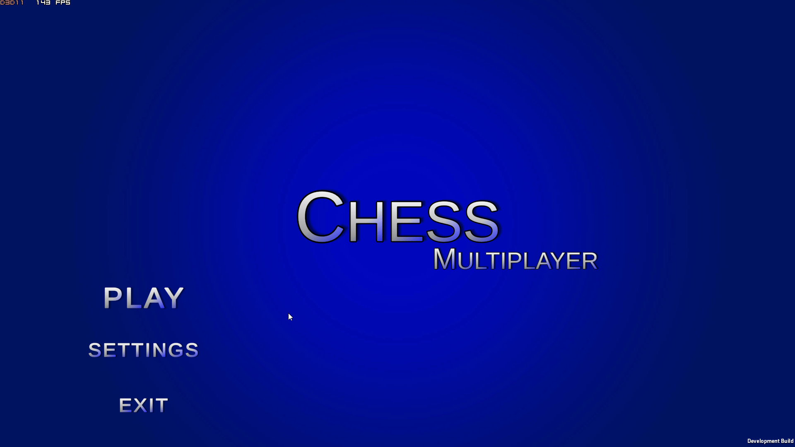

# ChessMP

- [ChessMP Final release v1](#chessmp-final-release-v1)
- [IT'S FINAL RELEASE](#its-final-release)
  - [Changelog 2021-05-16:](#changelog-2021-05-16)
- [We are going to space!! 🚀🌌](#we-are-going-to-space-)
  - [Changelog 2021-04-12:](#changelog-2021-04-12)
    - [A gif showcasing main menu in version 0.2](#a-gif-showcasing-main-menu-in-version-02)
    - [A gif showcasing the gameplay in version 0.2](#a-gif-showcasing-the-gameplay-in-version-02)
  - [Changelog 2021-02-28:](#changelog-2021-02-28)
    - [A gif showcasing the new Main Menu in version 0.1](#a-gif-showcasing-the-new-main-menu-in-version-01)
#

# IT'S FINAL RELEASE V1.0
## Changelog 2021-05-16:
+ ## Main menu
  + Settings menu will now save player preferences upon exiting
  + Play online leads you to a random online room
  + Play local leads you to a local 1v1 game mode
+ ## Game
  + Redefined way of highlighting possible moves
+ ## Game UI
  + Working UI:
    + Movement history
    + White and Black captured pieces
    + Winner pop up actually works

# We are going to space!! 🚀🌌

## Changelog 2021-04-12:
+ ## Main menu
  + Main menu is still in an early stage, but in more redefined way
  + Settings in the main menu have:
    + Name change
    + Video graphics and resoliution change. Fullscreen option
    + Audio settings: sounds and background music volume sliders
  + There are 2 play buttons, both lead to the same local 1v1 game mode
+ ## Game
  + Local game mode has basic chess movement logic, meaning the only way to win is to take out the king
  + Chess pieces have shaders:
    + Black pieces have red shader around
    + White pieces have blue shader around 
  + Got rid of generic Unity skybox. (Went cosmic theme)
+ ## Game UI
  + Non working game UI that will work (soon™) includes:
    + Game time
    + Captured pieces (yours and opponent)
    + Movement history
    + Winner notification pop-up

### A gif showcasing main menu in version 0.2

### A gif showcasing the gameplay in version 0.2

#

## Changelog 2021-02-28:
+ Game has a functioning main menu, but it is at an early stage
+ Game has a game board that accessible from the "Play" button in the main menu

### A gif showcasing the new Main Menu in version 0.1

